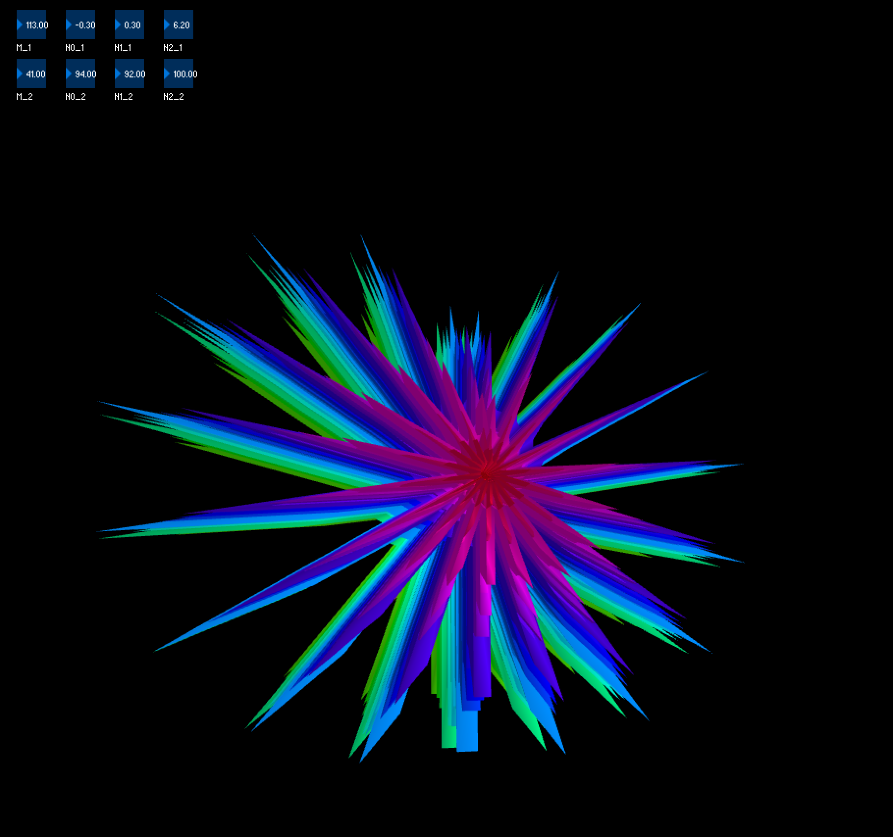

### Super Shapes

Creates 3D generated shapes, given a number of parameters.

Based on the original project by [Paul Bourke](http://paulbourke.net/geometry/supershape/), equations from Johan Gielis. Finally tutorial based on [Coding Rainbow](http://codingrainbow.com/), with parameter alterations by me!

